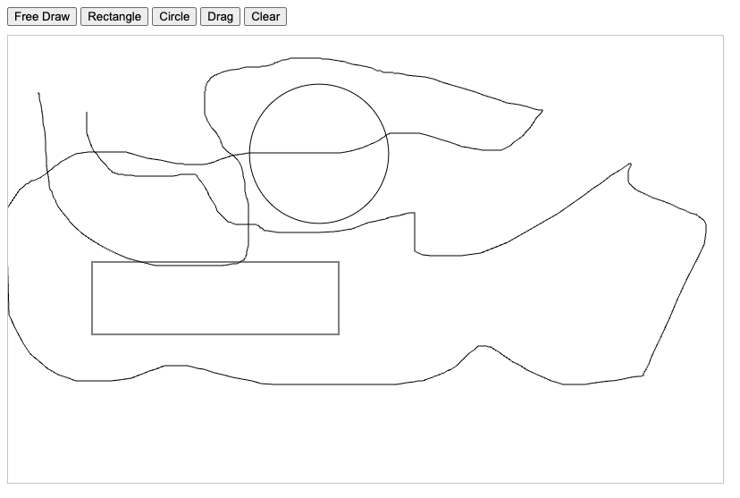

# ✏️ Scribble

A lightweight canvas-based drawing application built with **TypeScript** and **Vanilla JS**. Draw freely, drag shapes, and sketch rectangles or circles with ease.



---

## 🚀 Features

- ✍️ Freehand Drawing
- ⬛ Rectangle Tool
- 🟠 Circle Tool
- ✋ Drag Mode (move shapes)
- 🧹 Clear Canvas
- 🎯 Shape hover effects

---

## 🧑‍💻 Getting Started

### ⚙️ Prerequisites

- Node.js (>= 18.x)
- Yarn (recommended) or npm

---

### 📦 Installation

```bash
# clone the repo
git clone https://github.com/yourusername/scribble.git
cd scribble

# install dependencies
yarn install
```

---

### 📦 Installation

```bash
# run project
yarn dev

# build project
yarn build
```